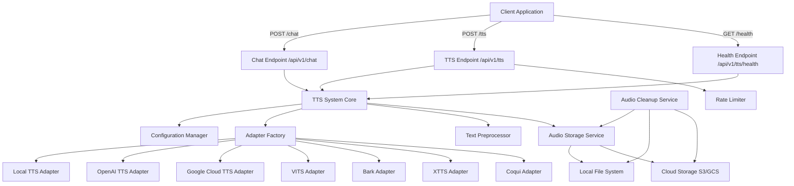

# Design Document: Flexible TTS System

## Overview

The Flexible TTS System provides text-to-speech capabilities for the Pillow Talk backend with support for three operational modes: local (client-side), cloud (third-party APIs), and self-hosted (self-deployed models). The system uses an adapter pattern to provide a consistent interface across different TTS providers, enabling easy provider switching and extensibility.

The system integrates with the existing chat endpoint to provide audio responses alongside text, and offers a standalone TTS endpoint for arbitrary text-to-speech conversion. Audio files are stored with configurable retention policies, and the system includes comprehensive error handling, rate limiting, and monitoring capabilities.

Key design goals:
- Provider-agnostic architecture through adapter pattern
- Graceful degradation when TTS fails (text responses always succeed)
- Efficient audio storage with automatic cleanup
- Support for streaming and non-streaming modes
- Comprehensive configuration validation at startup
- Production-ready monitoring and logging

## Architecture

### System Components



### Architectural Patterns

1. **Adapter Pattern**: Each TTS provider is wrapped in an adapter implementing a common interface, allowing the system to work with any provider without changing core logic.

2. **Factory Pattern**: The Adapter Factory creates the appropriate adapter instance based on configuration, centralizing provider instantiation logic.

3. **Strategy Pattern**: Text preprocessing strategies can be configured (URL handling, markdown stripping, code block handling).

4. **Graceful Degradation**: Chat endpoint always returns text responses even if audio generation fails, ensuring core functionality remains available.

### Data Flow

#### Chat Endpoint with TTS
1. Client sends chat request with `tts_enabled=true`
2. Chat endpoint generates text response
3. If TTS enabled, text is passed to TTS System
4. Text Preprocessor normalizes text
5. Adapter Factory selects appropriate adapter
6. Adapter generates audio via provider
7. Audio Storage saves file and generates URL
8. Response includes both text and audio_url

#### Standalone TTS Endpoint
1. Client sends TTS request with text
2. Rate Limiter checks request quota
3. Text Preprocessor normalizes text
4. Adapter Factory selects appropriate adapter
5. Adapter generates audio via provider
6. Audio Storage saves file and generates URL
7. Response includes audio_url and metadata

#### Audio Cleanup
1. Cleanup Service runs on schedule (e.g., hourly)
2. Scans audio storage for files older than expiration time
3. Deletes expired files and metadata
4. Logs cleanup operations

## Components and Interfaces

### TTS Adapter Interface

```python
from abc import ABC, abstractmethod
from typing import List, Dict, Any, Optional
from dataclasses import dataclass

@dataclass
class AudioResult:
    """Result from TTS generation"""
    audio_data: bytes
    format: str  # 'mp3', 'wav', 'ogg'
    duration: float  # seconds
    sample_rate: int
    metadata: Dict[str, Any]

@dataclass
class VoiceProfile:
    """Voice configuration"""
    voice_id: str
    name: str
    language: str
    gender: Optional[str]
    provider_specific: Dict[str, Any]

class TTSAdapter(ABC):
    """Base interface for all TTS providers"""
    
    @abstractmethod
    def synthesize(
        self,
        text: str,
        voice: Optional[str] = None,
        speed: float = 1.0,
        audio_format: str = 'mp3'
    ) -> AudioResult:
        """
        Generate audio from text.
        
        Args:
            text: Text to convert to speech
            voice: Voice ID to use (None for default)
            speed: Speech speed multiplier (0.25-4.0)
            audio_format: Desired audio format
            
        Returns:
            AudioResult with generated audio
            
        Raises:
            TTSGenerationError: If generation fails
            TTSProviderUnavailableError: If provider is unreachable
        """
        pass
    
    @abstractmethod
    def synthesize_streaming(
        self,
        text: str,
        voice: Optional[str] = None,
        speed: float = 1.0,
        audio_format: str = 'mp3'
    ) -> Iterator[bytes]:
        """
        Generate audio from text in streaming mode.
        
        Yields audio chunks as they are generated.
        Falls back to non-streaming if not supported.
        """
        pass
    
    @abstractmethod
    def get_voices(self) -> List[VoiceProfile]:
        """
        Get available voices for this provider.
        
        Returns:
            List of available voice profiles
        """
        pass
    
    @abstractmethod
    def validate_config(self) -> bool:
        """
        Validate adapter configuration.
        
        Returns:
            True if configuration is valid
            
        Raises:
            ConfigurationError: If configuration is invalid
        """
        pass
    
    @abstractmethod
    def health_check(self) -> Dict[str, Any]:
        """
        Check provider health and connectivity.
        
        Returns:
            Dict with status, response_time, and details
        """
        pass
```

### Configuration Manager

```python
from enum import Enum
from typing import Optional
from pydantic import BaseModel, Field, validator

class TTSMode(str, Enum):
    LOCAL = "local"
    CLOUD = "cloud"
    SELF_HOSTED = "self-hosted"

class CloudProvider(str, Enum):
    OPENAI = "openai"
    GOOGLE = "google"

class SelfHostedProvider(str, Enum):
    VITS = "vits"
    BARK = "bark"
    XTTS = "xtts"
    COQUI = "coqui"

class TTSConfig(BaseModel):
    """TTS system configuration"""
    mode: TTSMode
    cloud_provider: Optional[CloudProvider] = None
    self_hosted_provider: Optional[SelfHostedProvider] = None
    
    # API credentials
    openai_api_key: Optional[str] = None
    google_credentials_path: Optional[str] = None
    
    # Self-hosted endpoints
    self_hosted_endpoint: Optional[str] = None
    
    # Audio settings
    default_voice: str = "default"
    default_speed: float = 1.0
    default_format: str = "mp3"
    max_text_length: int = 5000
    
    # Storage settings
    storage_type: str = "local"  # 'local' or 'cloud'
    local_storage_path: str = "./audio_files"
    cloud_storage_bucket: Optional[str] = None
    base_url: str = "http://localhost:8000"
    
    # Cleanup settings
    audio_expiration_hours: int = 24
    cleanup_interval_hours: int = 1
    
    # Rate limiting
    rate_limit_per_minute: int = 60
    
    # Text preprocessing
    url_handling: str = "replace"  # 'replace', 'remove', 'keep'
    code_block_handling: str = "replace"  # 'replace', 'skip', 'keep'
    strip_markdown: bool = True
    
    # Retry settings
    max_retries: int = 3
    retry_backoff_base: float = 2.0
    
    @validator('mode')
    def validate_mode(cls, v, values):
        if v not in TTSMode:
            raise ValueError(f"Invalid TTS mode: {v}")
        return v
    
    @validator('cloud_provider')
    def validate_cloud_provider(cls, v, values):
        if values.get('mode') == TTSMode.CLOUD and v is None:
            raise ValueError("cloud_provider required when mode is 'cloud'")
        return v
    
    @validator('self_hosted_provider')
    def validate_self_hosted_provider(cls, v, values):
        if values.get('mode') == TTSMode.SELF_HOSTED and v is None:
            raise ValueError("self_hosted_provider required when mode is 'self-hosted'")
        return v

class ConfigurationManager:
    """Manages TTS configuration and validation"""
    
    def __init__(self, config_path: str):
        self.config = self._load_config(config_path)
        self.validate_config()
    
    def _load_config(self, path: str) -> TTSConfig:
        """Load configuration from file"""
        # Implementation loads from YAML/JSON
        pass
    
    def validate_config(self) -> None:
        """Validate configuration at startup"""
        # Pydantic handles basic validation
        # Additional checks:
        if self.config.mode == TTSMode.CLOUD:
            self._validate_cloud_config()
        elif self.config.mode == TTSMode.SELF_HOSTED:
            self._validate_self_hosted_config()
    
    def _validate_cloud_config(self) -> None:
        """Validate cloud provider configuration"""
        if self.config.cloud_provider == CloudProvider.OPENAI:
            if not self.config.openai_api_key:
                raise ConfigurationError("openai_api_key required")
        elif self.config.cloud_provider == CloudProvider.GOOGLE:
            if not self.config.google_credentials_path:
                raise ConfigurationError("google_credentials_path required")
    
    def _validate_self_hosted_config(self) -> None:
        """Validate self-hosted configuration"""
        if not self.config.self_hosted_endpoint:
            raise ConfigurationError("self_hosted_endpoint required")
        # Test connectivity
        try:
            response = requests.get(
                f"{self.config.self_hosted_endpoint}/health",
                timeout=10
            )
            response.raise_for_status()
        except Exception as e:
            raise ConfigurationError(
                f"Cannot reach self-hosted endpoint: {e}"
            )
```

### TTS System Core

```python
class TTSSystem:
    """Core TTS system orchestrator"""
    
    def __init__(self, config_manager: ConfigurationManager):
        self.config = config_manager.config
        self.adapter_factory = AdapterFactory(config_manager)
        self.adapter = self.adapter_factory.create_adapter()
        self.text_preprocessor = TextPreprocessor(self.config)
        self.audio_storage = AudioStorage(self.config)
        self.logger = logging.getLogger(__name__)
    
    def generate_audio(
        self,
        text: str,
        voice: Optional[str] = None,
        speed: Optional[float] = None,
        audio_format: Optional[str] = None
    ) -> Optional[AudioResponse]:
        """
        Generate audio from text.
        
        Returns None if mode is LOCAL.
        Raises exceptions for other errors.
        """
        # Check if local mode
        if self.config.mode == TTSMode.LOCAL:
            return None
        
        # Preprocess text
        processed_text = self.text_preprocessor.process(text)
        
        # Use defaults if not specified
        voice = voice or self.config.default_voice
        speed = speed or self.config.default_speed
        audio_format = audio_format or self.config.default_format
        
        # Validate parameters
        speed = self._validate_speed(speed)
        voice = self._validate_voice(voice)
        
        # Generate audio
        try:
            audio_result = self.adapter.synthesize(
                text=processed_text,
                voice=voice,
                speed=speed,
                audio_format=audio_format
            )
            
            # Store audio
            audio_url = self.audio_storage.store_audio(
                audio_data=audio_result.audio_data,
                format=audio_result.format,
                metadata={
                    'duration': audio_result.duration,
                    'voice': voice,
                    'speed': speed,
                    'text_length': len(text)
                }
            )
            
            return AudioResponse(
                audio_url=audio_url,
                duration=audio_result.duration,
                format=audio_result.format,
                voice=voice,
                speed=speed
            )
            
        except Exception as e:
            self.logger.error(
                f"TTS generation failed: {e}",
                extra={
                    'text_length': len(text),
                    'voice': voice,
                    'speed': speed,
                    'provider': self.config.mode
                }
            )
            raise
    
    def generate_audio_streaming(
        self,
        text: str,
        voice: Optional[str] = None,
        speed: Optional[float] = None,
        audio_format: Optional[str] = None
    ) -> Iterator[bytes]:
        """Generate audio in streaming mode"""
        if self.config.mode == TTSMode.LOCAL:
            raise TTSError("Streaming not available in local mode")
        
        processed_text = self.text_preprocessor.process(text)
        voice = voice or self.config.default_voice
        speed = speed or self.config.default_speed
        audio_format = audio_format or self.config.default_format
        
        return self.adapter.synthesize_streaming(
            text=processed_text,
            voice=voice,
            speed=speed,
            audio_format=audio_format
        )
    
    def _validate_speed(self, speed: float) -> float:
        """Validate and clamp speed parameter"""
        if speed < 0.25:
            self.logger.warning(f"Speed {speed} too low, clamping to 0.25")
            return 0.25
        if speed > 4.0:
            self.logger.warning(f"Speed {speed} too high, clamping to 4.0")
            return 4.0
        return speed
    
    def _validate_voice(self, voice: str) -> str:
        """Validate voice parameter"""
        available_voices = self.adapter.get_voices()
        voice_ids = [v.voice_id for v in available_voices]
        
        if voice not in voice_ids:
            self.logger.warning(
                f"Voice {voice} not available, using default"
            )
            return self.config.default_voice
        
        return voice
    
    def health_check(self) -> Dict[str, Any]:
        """Check system health"""
        return self.adapter.health_check()
```

### Audio Storage Service

```python
import uuid
from pathlib import Path
from datetime import datetime
import json

class AudioStorage:
    """Manages audio file storage and URL generation"""
    
    def __init__(self, config: TTSConfig):
        self.config = config
        self.storage_path = Path(config.local_storage_path)
        self.storage_path.mkdir(parents=True, exist_ok=True)
    
    def store_audio(
        self,
        audio_data: bytes,
        format: str,
        metadata: Dict[str, Any]
    ) -> str:
        """
        Store audio file and return URL.
        
        Args:
            audio_data: Raw audio bytes
            format: Audio format (mp3, wav, ogg)
            metadata: Audio metadata to store
            
        Returns:
            URL to access the audio file
        """
        # Generate unique filename
        file_id = str(uuid.uuid4())
        filename = f"{file_id}.{format}"
        filepath = self.storage_path / filename
        
        # Write audio file
        with open(filepath, 'wb') as f:
            f.write(audio_data)
        
        # Write metadata sidecar
        metadata_path = self.storage_path / f"{file_id}.json"
        metadata['created_at'] = datetime.utcnow().isoformat()
        metadata['filename'] = filename
        metadata['size_bytes'] = len(audio_data)
        
        with open(metadata_path, 'w') as f:
            json.dump(metadata, f)
        
        # Generate URL
        if self.config.storage_type == "local":
            return f"{self.config.base_url}/audio/{filename}"
        else:
            # Upload to cloud storage and return cloud URL
            return self._upload_to_cloud(filepath, filename)
    
    def _upload_to_cloud(self, filepath: Path, filename: str) -> str:
        """Upload file to cloud storage"""
        # Implementation for S3/GCS upload
        pass
    
    def get_metadata(self, file_id: str) -> Optional[Dict[str, Any]]:
        """Retrieve metadata for an audio file"""
        metadata_path = self.storage_path / f"{file_id}.json"
        if not metadata_path.exists():
            return None
        
        with open(metadata_path, 'r') as f:
            return json.load(f)
    
    def delete_file(self, file_id: str) -> bool:
        """Delete audio file and metadata"""
        deleted = False
        
        # Find and delete audio file
        for ext in ['mp3', 'wav', 'ogg']:
            audio_path = self.storage_path / f"{file_id}.{ext}"
            if audio_path.exists():
                audio_path.unlink()
                deleted = True
        
        # Delete metadata
        metadata_path = self.storage_path / f"{file_id}.json"
        if metadata_path.exists():
            metadata_path.unlink()
        
        return deleted
```

### Text Preprocessor

```python
import re
from typing import Pattern

class TextPreprocessor:
    """Preprocesses text before TTS conversion"""
    
    def __init__(self, config: TTSConfig):
        self.config = config
        self.url_pattern: Pattern = re.compile(
            r'http[s]?://(?:[a-zA-Z]|[0-9]|[$-_@.&+]|[!*\\(\\),]|(?:%[0-9a-fA-F][0-9a-fA-F]))+'
        )
        self.code_block_pattern: Pattern = re.compile(
            r'```[\s\S]*?```|`[^`]+`'
        )
    
    def process(self, text: str) -> str:
        """
        Preprocess text for TTS.
        
        Args:
            text: Raw input text
            
        Returns:
            Processed text ready for TTS
        """
        # Truncate if too long
        if len(text) > self.config.max_text_length:
            logging.warning(
                f"Text length {len(text)} exceeds max "
                f"{self.config.max_text_length}, truncating"
            )
            text = text[:self.config.max_text_length]
        
        # Handle URLs
        if self.config.url_handling == "replace":
            text = self.url_pattern.sub("link", text)
        elif self.config.url_handling == "remove":
            text = self.url_pattern.sub("", text)
        
        # Handle code blocks
        if self.config.code_block_handling == "replace":
            text = self.code_block_pattern.sub("code block", text)
        elif self.config.code_block_handling == "skip":
            text = self.code_block_pattern.sub("", text)
        
        # Strip markdown
        if self.config.strip_markdown:
            text = self._strip_markdown(text)
        
        # Normalize whitespace
        text = re.sub(r'\s+', ' ', text)
        text = text.strip()
        
        return text
    
    def _strip_markdown(self, text: str) -> str:
        """Remove markdown formatting"""
        # Remove headers
        text = re.sub(r'^#+\s+', '', text, flags=re.MULTILINE)
        # Remove bold/italic
        text = re.sub(r'\*\*([^*]+)\*\*', r'\1', text)
        text = re.sub(r'\*([^*]+)\*', r'\1', text)
        text = re.sub(r'__([^_]+)__', r'\1', text)
        text = re.sub(r'_([^_]+)_', r'\1', text)
        # Remove links but keep text
        text = re.sub(r'\[([^\]]+)\]\([^\)]+\)', r'\1', text)
        return text
```

### Rate Limiter

```python
from collections import defaultdict
from datetime import datetime, timedelta
from threading import Lock

class RateLimiter:
    """Token bucket rate limiter"""
    
    def __init__(self, max_requests: int, window_minutes: int = 1):
        self.max_requests = max_requests
        self.window_seconds = window_minutes * 60
        self.requests: Dict[str, List[datetime]] = defaultdict(list)
        self.lock = Lock()
    
    def check_rate_limit(self, client_id: str) -> bool:
        """
        Check if request is within rate limit.
        
        Args:
            client_id: Client identifier (IP address)
            
        Returns:
            True if request is allowed, False if rate limited
        """
        with self.lock:
            now = datetime.utcnow()
            cutoff = now - timedelta(seconds=self.window_seconds)
            
            # Remove old requests
            self.requests[client_id] = [
                req_time for req_time in self.requests[client_id]
                if req_time > cutoff
            ]
            
            # Check limit
            if len(self.requests[client_id]) >= self.max_requests:
                return False
            
            # Add current request
            self.requests[client_id].append(now)
            return True
```

### Audio Cleanup Service

```python
from datetime import datetime, timedelta
import schedule
import time
from threading import Thread

class AudioCleanupService:
    """Background service for cleaning up expired audio files"""
    
    def __init__(self, audio_storage: AudioStorage, config: TTSConfig):
        self.audio_storage = audio_storage
        self.config = config
        self.running = False
        self.thread: Optional[Thread] = None
        self.logger = logging.getLogger(__name__)
    
    def start(self):
        """Start the cleanup service"""
        self.running = True
        schedule.every(self.config.cleanup_interval_hours).hours.do(
            self.cleanup
        )
        
        self.thread = Thread(target=self._run_schedule, daemon=True)
        self.thread.start()
        self.logger.info("Audio cleanup service started")
    
    def stop(self):
        """Stop the cleanup service"""
        self.running = False
        if self.thread:
            self.thread.join(timeout=5)
        self.logger.info("Audio cleanup service stopped")
    
    def _run_schedule(self):
        """Run scheduled tasks"""
        while self.running:
            schedule.run_pending()
            time.sleep(60)
    
    def cleanup(self):
        """Remove expired audio files"""
        self.logger.info("Starting audio cleanup")
        cutoff_time = datetime.utcnow() - timedelta(
            hours=self.config.audio_expiration_hours
        )
        
        deleted_count = 0
        error_count = 0
        
        # Scan all metadata files
        for metadata_file in self.audio_storage.storage_path.glob("*.json"):
            try:
                with open(metadata_file, 'r') as f:
                    metadata = json.load(f)
                
                created_at = datetime.fromisoformat(metadata['created_at'])
                
                if created_at < cutoff_time:
                    file_id = metadata_file.stem
                    if self.audio_storage.delete_file(file_id):
                        deleted_count += 1
                        self.logger.debug(
                            f"Deleted expired audio: {file_id}"
                        )
            
            except Exception as e:
                error_count += 1
                self.logger.error(
                    f"Error cleaning up {metadata_file}: {e}"
                )
        
        self.logger.info(
            f"Cleanup complete: {deleted_count} deleted, "
            f"{error_count} errors"
        )
```

## Data Models

### Request Models

```python
from pydantic import BaseModel, Field, validator
from typing import Optional

class ChatRequest(BaseModel):
    """Chat endpoint request"""
    message: str
    tts_enabled: bool = False
    tts_voice: Optional[str] = None
    tts_speed: Optional[float] = None
    # ... other chat fields

class TTSRequest(BaseModel):
    """Standalone TTS endpoint request"""
    text: str = Field(..., min_length=1, max_length=5000)
    voice: Optional[str] = None
    speed: Optional[float] = Field(default=1.0, ge=0.25, le=4.0)
    audio_format: Optional[str] = Field(default="mp3")
    stream: bool = False
    
    @validator('text')
    def validate_text(cls, v):
        if not v or not v.strip():
            raise ValueError("Text cannot be empty")
        return v
    
    @validator('audio_format')
    def validate_format(cls, v):
        if v not in ['mp3', 'wav', 'ogg']:
            raise ValueError(f"Unsupported format: {v}")
        return v
```

### Response Models

```python
from pydantic import BaseModel
from typing import Optional

class AudioResponse(BaseModel):
    """Audio generation response"""
    audio_url: str
    duration: float
    format: str
    voice: str
    speed: float

class ChatResponse(BaseModel):
    """Chat endpoint response"""
    message: str
    audio_url: Optional[str] = None
    audio_metadata: Optional[Dict[str, Any]] = None
    # ... other chat fields

class TTSResponse(BaseModel):
    """TTS endpoint response"""
    audio_url: str
    duration: float
    format: str
    voice: str
    speed: float
    text_length: int

class HealthResponse(BaseModel):
    """Health check response"""
    status: str  # 'healthy' or 'unhealthy'
    provider: str
    mode: str
    response_time_ms: float
    details: Optional[Dict[str, Any]] = None

class ErrorResponse(BaseModel):
    """Error response"""
    error: str
    message: str
    details: Optional[Dict[str, Any]] = None
```

### Database Models

```python
# If logging to database instead of files

class TTSRequestLog(BaseModel):
    """TTS request log entry"""
    id: str
    timestamp: datetime
    client_ip: str
    text_length: int
    voice: str
    speed: float
    audio_format: str
    mode: str
    provider: str
    success: bool
    error_message: Optional[str]
    duration_ms: float
    audio_size_bytes: Optional[int]
```


## Correctness Properties

A property is a characteristic or behavior that should hold true across all valid executions of a system—essentially, a formal statement about what the system should do. Properties serve as the bridge between human-readable specifications and machine-verifiable correctness guarantees.

### Property 1: Configuration validation accepts only valid modes

For any configuration, the Configuration_Manager should accept only "local", "cloud", or "self-hosted" as valid TTS_Mode values, and reject all other values.

**Validates: Requirements 1.2**

### Property 2: Cloud mode requires cloud provider

For any configuration with TTS_Mode set to "cloud", the Configuration_Manager should require that cloud_provider is specified as either "openai" or "google".

**Validates: Requirements 1.3**

### Property 3: Self-hosted mode requires self-hosted provider

For any configuration with TTS_Mode set to "self-hosted", the Configuration_Manager should require that self_hosted_provider is specified as one of "vits", "bark", "xtts", or "coqui".

**Validates: Requirements 1.4**

### Property 4: Invalid configuration raises descriptive error

For any invalid configuration, the Configuration_Manager should raise a ConfigurationError with a message describing what is invalid.

**Validates: Requirements 1.5**

### Property 5: Adapter routing matches configuration

For any TTS_Request and configuration, the TTS_System should route the request to the adapter corresponding to the configured mode and provider.

**Validates: Requirements 2.3**

### Property 6: All adapters return consistent format

For any TTS_Adapter and valid input, the synthesize method should return an AudioResult with the same structure (audio_data, format, duration, sample_rate, metadata fields).

**Validates: Requirements 2.4**

### Property 7: Adapter initialization failure raises exception

For any TTS_Adapter that fails to initialize, the TTS_System should raise an initialization exception and log the error.

**Validates: Requirements 2.5**

### Property 8: Local mode returns no audio URL

For any request to Chat_Endpoint or TTS_Endpoint when TTS_Mode is "local", the response should have audio_url set to None (Chat) or return a 400 error (TTS).

**Validates: Requirements 3.1, 3.2, 3.4**

### Property 9: Local mode includes TTS metadata

For any Chat_Endpoint request when TTS_Mode is "local", the response metadata should include tts_voice and tts_speed parameters.

**Validates: Requirements 3.3**

### Property 10: Cloud adapter retries on failure

For any cloud TTS_Adapter when a request fails, the adapter should retry up to 3 times with exponential backoff before raising an error.

**Validates: Requirements 4.4**

### Property 11: Exhausted retries raise error with provider message

For any cloud TTS_Adapter when all retry attempts fail, the adapter should raise a TTSGenerationError containing the provider's error message.

**Validates: Requirements 4.5**

### Property 12: Self-hosted timeout within 10 seconds

For any self-hosted TTS_Adapter when the service is unreachable, the adapter should raise a connection error within 10 seconds.

**Validates: Requirements 5.4**

### Property 13: Self-hosted response parsing returns standard format

For any self-hosted TTS_Adapter and valid response, the adapter should parse the response and return it in the standard AudioResult format.

**Validates: Requirements 5.5**

### Property 14: TTS enabled generates audio

For any Chat_Endpoint request with tts_enabled=true and TTS_Mode not "local", the response should include a non-None audio_url.

**Validates: Requirements 6.1, 6.2**

### Property 15: Audio generation failure returns text gracefully

For any Chat_Endpoint request where audio generation fails, the response should include the text message with audio_url set to None.

**Validates: Requirements 6.3, 12.1**

### Property 16: TTS parameters are passed through

For any Chat_Endpoint request with tts_voice and tts_speed parameters, those parameters should be passed to the TTS_System and used in audio generation.

**Validates: Requirements 6.4**

### Property 17: TTS disabled skips audio generation

For any Chat_Endpoint request with tts_enabled=false, the response should have audio_url set to None and no audio generation should occur.

**Validates: Requirements 6.5**

### Property 18: Valid TTS request returns audio URL

For any valid TTS_Endpoint request when TTS_Mode is not "local", the response should include a valid audio_url.

**Validates: Requirements 7.2**

### Property 19: Text validation enforces length limits

For any TTS_Endpoint request, the text parameter should be non-empty and not exceed 5000 characters, otherwise a 422 error should be returned.

**Validates: Requirements 7.4, 7.5**

### Property 20: Audio filenames are unique

For any two audio files generated by Audio_Storage, the filenames should be unique (no collisions).

**Validates: Requirements 8.1**

### Property 21: Filename format includes UUID and extension

For any audio file generated by Audio_Storage, the filename should match the pattern `{uuid}.{extension}` where extension is mp3, wav, or ogg.

**Validates: Requirements 8.2**

### Property 22: Audio URL is accessible

For any audio_url returned by Audio_Storage, a GET request to that URL should successfully return the audio file.

**Validates: Requirements 8.3**

### Property 23: Local storage saves to configured directory

For any audio file when storage_type is "local", the Audio_Storage should save the file to the configured local_storage_path and generate a URL with the server's base_url.

**Validates: Requirements 8.5**

### Property 24: Specified voice is used

For any TTS_Request with a valid voice parameter, the TTS_System should use that voice for audio generation.

**Validates: Requirements 9.2**

### Property 25: Default voice is used when unspecified

For any TTS_Request without a voice parameter, the TTS_System should use the default_voice from configuration.

**Validates: Requirements 9.3**

### Property 26: Invalid voice falls back to default

For any TTS_Request with an invalid voice parameter, the TTS_System should fall back to the default voice and log a warning.

**Validates: Requirements 9.4, 9.5**

### Property 27: Specified speed is applied

For any TTS_Request with a speed parameter in the valid range (0.25-4.0), the TTS_System should apply that speed to audio generation.

**Validates: Requirements 10.1**

### Property 28: Speed validation enforces bounds

For any TTS_Request, the speed parameter should be validated to be between 0.25 and 4.0.

**Validates: Requirements 10.2**

### Property 29: Default speed is used when unspecified

For any TTS_Request without a speed parameter, the TTS_System should use the default speed of 1.0.

**Validates: Requirements 10.3**

### Property 30: Out-of-range speed is clamped

For any TTS_Request with a speed parameter outside the valid range, the TTS_System should clamp it to the nearest valid value (0.25 or 4.0) and log a warning.

**Validates: Requirements 10.4**

### Property 31: Expired files are deleted

For any audio file older than the configured expiration time, the Audio_Cleanup_Service should delete the file during cleanup.

**Validates: Requirements 11.2**

### Property 32: File deletion is logged

For any audio file deleted by Audio_Cleanup_Service, the deletion should be logged with the filename and timestamp.

**Validates: Requirements 11.3**

### Property 33: Cleanup continues after deletion errors

For any Audio_Cleanup_Service run where one file deletion fails, the service should continue processing remaining files.

**Validates: Requirements 11.4**

### Property 34: TTS endpoint failure returns 500 error

For any TTS_Endpoint request where audio generation fails, the response should have status code 500 and include the error message.

**Validates: Requirements 12.2**

### Property 35: TTS errors are logged with context

For any TTS error, the TTS_System should log the error with provider name, error message, and request parameters.

**Validates: Requirements 12.3**

### Property 36: Unavailable provider raises service unavailable error

For any TTS_Provider that is temporarily unavailable, the TTS_System should raise a service unavailable error.

**Validates: Requirements 12.4**

### Property 37: TTS endpoint does not retry

For any failed TTS_Endpoint request, the TTS_System should not retry the request (client is responsible for retries).

**Validates: Requirements 12.5**

### Property 38: Specified format is used

For any TTS_Request with an audio_format parameter, the TTS_System should generate audio in that format.

**Validates: Requirements 13.2**

### Property 39: Default format is MP3

For any TTS_Request without an audio_format parameter, the TTS_System should generate audio in MP3 format.

**Validates: Requirements 13.3**

### Property 40: Unsupported format is converted

For any TTS_Request with a format not supported by the TTS_Provider, the TTS_System should generate audio in the provider's default format and convert it to the requested format.

**Validates: Requirements 13.4**

### Property 41: Content-Type header matches format

For any audio file served by Audio_Storage, the Content-Type header should match the audio format (audio/mpeg for mp3, audio/wav for wav, audio/ogg for ogg).

**Validates: Requirements 13.5**

### Property 42: Streaming returns incremental chunks

For any TTS_Request with streaming enabled and a provider that supports streaming, the TTS_System should return audio chunks incrementally as they are generated.

**Validates: Requirements 14.2**

### Property 43: Streaming response has correct Content-Type

For any TTS_Endpoint request with stream=true, the response should have Content-Type set to the appropriate audio format (e.g., "audio/mpeg").

**Validates: Requirements 14.4**

### Property 44: Non-streaming fallback when unsupported

For any TTS_Request with streaming enabled but a provider that doesn't support streaming, the TTS_System should fall back to non-streaming mode and log a warning.

**Validates: Requirements 14.5**

### Property 45: Cloud provider requires API keys

For any configuration with a cloud provider, the Configuration_Manager should verify that the required API key is present.

**Validates: Requirements 15.2**

### Property 46: Self-hosted endpoint is reachable

For any configuration with a self-hosted provider, the Configuration_Manager should verify that the self_hosted_endpoint is reachable.

**Validates: Requirements 15.3**

### Property 47: Invalid configuration prevents startup

For any invalid configuration, the Configuration_Manager should log detailed error messages and prevent application startup.

**Validates: Requirements 15.4**

### Property 48: Audio metadata includes required fields

For any audio generation response, the metadata should include duration, format, voice, and speed fields.

**Validates: Requirements 16.1**

### Property 49: Metadata is persisted with audio

For any audio file stored by Audio_Storage, a JSON sidecar file should be created containing the metadata.

**Validates: Requirements 16.2**

### Property 50: TTS endpoint returns metadata

For any TTS_Endpoint response, the response body should include metadata along with the audio_url.

**Validates: Requirements 16.3**

### Property 51: Chat endpoint includes metadata when audio present

For any Chat_Endpoint response with a non-None audio_url, the response should include audio_metadata.

**Validates: Requirements 16.4**

### Property 52: Audio duration is calculated

For any generated audio file, the TTS_System should calculate and include the duration in the metadata.

**Validates: Requirements 16.5**

### Property 53: Rate limiting enforced per IP

For any client IP address, the TTS_Endpoint should enforce rate limiting based on that IP.

**Validates: Requirements 17.1**

### Property 54: Rate limit threshold is 60 per minute

For any client IP address, the TTS_System should allow a maximum of 60 requests per minute.

**Validates: Requirements 17.2**

### Property 55: Rate limit exceeded returns 429

For any client IP address that exceeds the rate limit, the TTS_Endpoint should return a 429 status code.

**Validates: Requirements 17.3**

### Property 56: TTS requests are logged

For any TTS_Request, the TTS_System should log the request with timestamp, text length, voice, speed, and client IP.

**Validates: Requirements 18.1**

### Property 57: Audio completion is logged

For any completed audio generation, the TTS_System should log the completion with duration and audio file size.

**Validates: Requirements 18.2**

### Property 58: Errors are logged with context

For any TTS error, the TTS_System should log the error with full context including request parameters and error details.

**Validates: Requirements 18.3**

### Property 59: Full text is not logged

For any TTS_Request, the TTS_System should log only the text length, not the full text content.

**Validates: Requirements 18.4**

### Property 60: Health check verifies provider connectivity

For any health check request, the TTS_System should verify connectivity to the configured TTS_Provider.

**Validates: Requirements 19.2**

### Property 61: Healthy system returns 200

For any health check request when the TTS_System is healthy, the response should have status code 200.

**Validates: Requirements 19.3**

### Property 62: Unreachable provider returns 503

For any health check request when the TTS_Provider is unreachable, the response should have status code 503.

**Validates: Requirements 19.4**

### Property 63: Health check includes provider details

For any health check response, the body should include provider name, mode, and response time.

**Validates: Requirements 19.5**

### Property 64: URLs are handled according to configuration

For any text containing URLs, the TTS_System should replace them with "link" or remove them based on the url_handling configuration.

**Validates: Requirements 20.1**

### Property 65: Markdown formatting is stripped

For any text containing markdown formatting, the TTS_System should strip the formatting characters.

**Validates: Requirements 20.2**

### Property 66: Code blocks are handled according to configuration

For any text containing code blocks, the TTS_System should replace them with "code block" or skip them based on the code_block_handling configuration.

**Validates: Requirements 20.3**

### Property 67: Whitespace is normalized

For any text with multiple consecutive spaces, the TTS_System should replace them with a single space.

**Validates: Requirements 20.4**

### Property 68: Long text is truncated

For any text exceeding the maximum length, the TTS_System should truncate it to the maximum length and log a warning.

**Validates: Requirements 20.5**

## Error Handling

### Error Types

The system defines the following error types:

1. **ConfigurationError**: Raised when configuration is invalid or incomplete
2. **TTSGenerationError**: Raised when audio generation fails
3. **TTSProviderUnavailableError**: Raised when the TTS provider is unreachable
4. **TTSInitializationError**: Raised when an adapter fails to initialize
5. **RateLimitExceededError**: Raised when rate limit is exceeded
6. **ValidationError**: Raised when request validation fails

### Error Handling Strategy

1. **Configuration Errors**: Fail fast at startup with detailed error messages
2. **Generation Errors at Chat Endpoint**: Log error and return text response with audio_url=None (graceful degradation)
3. **Generation Errors at TTS Endpoint**: Return 500 error with error message
4. **Rate Limiting**: Return 429 error with retry-after information
5. **Validation Errors**: Return 422 error with validation details
6. **Provider Unavailable**: Retry for cloud providers (up to 3 times), fail immediately for self-hosted

### Error Response Format

```python
{
    "error": "error_type",
    "message": "Human-readable error message",
    "details": {
        "field": "Additional context",
        "provider": "openai",
        "retry_after": 60
    }
}
```

### Logging

All errors are logged with:
- Timestamp
- Error type and message
- Request context (text length, voice, speed, client IP)
- Provider information
- Stack trace (for unexpected errors)

## Testing Strategy

### Dual Testing Approach

The system requires both unit tests and property-based tests for comprehensive coverage:

**Unit Tests** focus on:
- Specific examples demonstrating correct behavior
- Integration points between components
- Edge cases (empty text, boundary values, special characters)
- Error conditions (invalid config, provider failures, network errors)
- Mocking external dependencies (cloud APIs, file system)

**Property-Based Tests** focus on:
- Universal properties that hold for all inputs
- Comprehensive input coverage through randomization
- Invariants that must be maintained
- Round-trip properties (serialization, parsing)
- Metamorphic properties (relationships between operations)

### Property-Based Testing Configuration

**Library Selection**: Use `hypothesis` for Python property-based testing

**Test Configuration**:
- Minimum 100 iterations per property test
- Each test references its design document property
- Tag format: `# Feature: flexible-tts-system, Property {number}: {property_text}`

**Example Property Test**:

```python
from hypothesis import given, strategies as st
import pytest

# Feature: flexible-tts-system, Property 28: Speed validation enforces bounds
@given(speed=st.floats(min_value=-100, max_value=100))
def test_speed_validation_enforces_bounds(speed):
    """For any speed value, the system should validate it's between 0.25 and 4.0"""
    tts_system = TTSSystem(config_manager)
    
    validated_speed = tts_system._validate_speed(speed)
    
    assert 0.25 <= validated_speed <= 4.0
```

### Test Organization

```
tests/
├── unit/
│   ├── test_configuration.py
│   ├── test_adapters.py
│   ├── test_audio_storage.py
│   ├── test_text_preprocessor.py
│   ├── test_rate_limiter.py
│   └── test_cleanup_service.py
├── property/
│   ├── test_configuration_properties.py
│   ├── test_adapter_properties.py
│   ├── test_audio_storage_properties.py
│   ├── test_text_preprocessing_properties.py
│   └── test_endpoint_properties.py
├── integration/
│   ├── test_chat_endpoint.py
│   ├── test_tts_endpoint.py
│   └── test_health_endpoint.py
└── fixtures/
    ├── mock_adapters.py
    ├── test_audio_files.py
    └── test_configs.py
```

### Key Test Scenarios

**Configuration Tests**:
- Valid configurations for all modes
- Invalid configurations raise appropriate errors
- API key validation for cloud providers
- Endpoint reachability for self-hosted providers

**Adapter Tests**:
- Each adapter returns consistent AudioResult format
- Retry logic for cloud providers
- Timeout handling for self-hosted providers
- Streaming fallback when not supported

**Audio Storage Tests**:
- Unique filename generation
- Metadata persistence
- URL generation and accessibility
- File cleanup based on expiration

**Text Preprocessing Tests**:
- URL handling (replace, remove, keep)
- Markdown stripping
- Code block handling
- Whitespace normalization
- Text truncation

**Endpoint Tests**:
- Chat endpoint with TTS enabled/disabled
- TTS endpoint with valid/invalid requests
- Rate limiting enforcement
- Error responses with correct status codes
- Health check endpoint

**Property Tests**:
- Speed clamping for out-of-range values
- Voice fallback for invalid voices
- Filename uniqueness across many generations
- Metadata completeness for all responses
- Rate limiting across many requests
- Text preprocessing for various input patterns

### Mocking Strategy

**External Dependencies to Mock**:
- OpenAI API calls
- Google Cloud API calls
- Self-hosted TTS service HTTP requests
- File system operations (for some tests)
- Cloud storage uploads

**Mock Implementations**:
- Create mock adapters that return predictable AudioResult objects
- Mock HTTP responses for self-hosted services
- Mock file system for testing cleanup without actual files
- Mock time for testing rate limiting and expiration

### Performance Testing

While not part of the correctness properties, performance tests should verify:
- Audio generation latency (< 5 seconds for typical requests)
- Streaming latency (first chunk < 1 second)
- Rate limiter overhead (< 10ms per request)
- Cleanup service performance (handles 10,000+ files efficiently)

### Integration Testing

Integration tests should verify:
- End-to-end flow from API request to audio file
- Chat endpoint integration with TTS system
- Audio storage integration with file system/cloud storage
- Cleanup service integration with audio storage
- Health check integration with actual providers (in staging environment)


## Implementation Notes

### Technology Stack

**Backend Framework**: FastAPI (Python 3.10+)
- Async support for streaming responses
- Built-in request validation with Pydantic
- OpenAPI documentation generation
- Easy dependency injection

**TTS Provider SDKs**:
- OpenAI: `openai` Python SDK
- Google Cloud: `google-cloud-texttospeech`
- Self-hosted: HTTP requests via `httpx`

**Storage**:
- Local: File system with `pathlib`
- Cloud: `boto3` (AWS S3) or `google-cloud-storage` (GCS)

**Testing**:
- `pytest` for test framework
- `hypothesis` for property-based testing
- `pytest-asyncio` for async tests
- `pytest-mock` for mocking

**Background Tasks**:
- `schedule` library for cleanup service
- Threading for background execution

### Implementation Phases

**Phase 1: Core Infrastructure**
1. Configuration management and validation
2. Base adapter interface
3. Audio storage service (local only)
4. Text preprocessor
5. TTS system core

**Phase 2: Adapters**
1. Local adapter (no-op implementation)
2. OpenAI adapter
3. Google Cloud adapter
4. Self-hosted adapters (VITS, Bark, XTTS, Coqui)

**Phase 3: API Endpoints**
1. TTS endpoint with basic functionality
2. Chat endpoint integration
3. Health check endpoint
4. Rate limiting middleware

**Phase 4: Advanced Features**
1. Streaming support
2. Cloud storage integration
3. Audio cleanup service
4. Comprehensive logging

**Phase 5: Production Readiness**
1. Error handling refinement
2. Monitoring and metrics
3. Performance optimization
4. Documentation

### Adapter Implementation Details

**OpenAI Adapter**:
```python
class OpenAIAdapter(TTSAdapter):
    def __init__(self, api_key: str):
        self.client = openai.Client(api_key=api_key)
        self.default_voice = "alloy"
        self.supported_voices = ["alloy", "echo", "fable", "onyx", "nova", "shimmer"]
    
    def synthesize(self, text: str, voice: Optional[str] = None, 
                   speed: float = 1.0, audio_format: str = 'mp3') -> AudioResult:
        response = self.client.audio.speech.create(
            model="tts-1",
            voice=voice or self.default_voice,
            input=text,
            speed=speed,
            response_format=audio_format
        )
        
        audio_data = response.content
        duration = self._calculate_duration(audio_data, audio_format)
        
        return AudioResult(
            audio_data=audio_data,
            format=audio_format,
            duration=duration,
            sample_rate=24000,
            metadata={'model': 'tts-1', 'voice': voice}
        )
```

**Google Cloud Adapter**:
```python
class GoogleCloudAdapter(TTSAdapter):
    def __init__(self, credentials_path: str):
        self.client = texttospeech.TextToSpeechClient.from_service_account_file(
            credentials_path
        )
    
    def synthesize(self, text: str, voice: Optional[str] = None,
                   speed: float = 1.0, audio_format: str = 'mp3') -> AudioResult:
        synthesis_input = texttospeech.SynthesisInput(text=text)
        
        voice_params = texttospeech.VoiceSelectionParams(
            language_code="en-US",
            name=voice or "en-US-Neural2-C"
        )
        
        audio_config = texttospeech.AudioConfig(
            audio_encoding=self._format_to_encoding(audio_format),
            speaking_rate=speed
        )
        
        response = self.client.synthesize_speech(
            input=synthesis_input,
            voice=voice_params,
            audio_config=audio_config
        )
        
        return AudioResult(
            audio_data=response.audio_content,
            format=audio_format,
            duration=self._calculate_duration(response.audio_content, audio_format),
            sample_rate=24000,
            metadata={'voice': voice_params.name}
        )
```

**Self-Hosted Adapter (Generic)**:
```python
class SelfHostedAdapter(TTSAdapter):
    def __init__(self, endpoint: str, provider: str):
        self.endpoint = endpoint
        self.provider = provider
        self.client = httpx.AsyncClient(timeout=10.0)
    
    async def synthesize(self, text: str, voice: Optional[str] = None,
                        speed: float = 1.0, audio_format: str = 'mp3') -> AudioResult:
        payload = {
            'text': text,
            'voice': voice,
            'speed': speed,
            'format': audio_format
        }
        
        try:
            response = await self.client.post(
                f"{self.endpoint}/synthesize",
                json=payload
            )
            response.raise_for_status()
            
            audio_data = response.content
            duration = self._calculate_duration(audio_data, audio_format)
            
            return AudioResult(
                audio_data=audio_data,
                format=audio_format,
                duration=duration,
                sample_rate=22050,
                metadata={'provider': self.provider}
            )
        
        except httpx.TimeoutException:
            raise TTSProviderUnavailableError(
                f"Self-hosted service at {self.endpoint} timed out"
            )
        except httpx.HTTPError as e:
            raise TTSGenerationError(f"Self-hosted service error: {e}")
```

### API Endpoint Implementation

**TTS Endpoint**:
```python
@app.post("/api/v1/tts", response_model=TTSResponse)
async def generate_tts(
    request: TTSRequest,
    client_ip: str = Depends(get_client_ip),
    tts_system: TTSSystem = Depends(get_tts_system),
    rate_limiter: RateLimiter = Depends(get_rate_limiter)
):
    # Check rate limit
    if not rate_limiter.check_rate_limit(client_ip):
        raise HTTPException(
            status_code=429,
            detail="Rate limit exceeded. Please try again later."
        )
    
    # Check if local mode
    if tts_system.config.mode == TTSMode.LOCAL:
        raise HTTPException(
            status_code=400,
            detail="TTS is configured for local mode"
        )
    
    # Log request
    logger.info(
        "TTS request received",
        extra={
            'client_ip': client_ip,
            'text_length': len(request.text),
            'voice': request.voice,
            'speed': request.speed
        }
    )
    
    try:
        # Generate audio
        if request.stream:
            return StreamingResponse(
                tts_system.generate_audio_streaming(
                    text=request.text,
                    voice=request.voice,
                    speed=request.speed,
                    audio_format=request.audio_format
                ),
                media_type=f"audio/{request.audio_format}"
            )
        else:
            audio_response = tts_system.generate_audio(
                text=request.text,
                voice=request.voice,
                speed=request.speed,
                audio_format=request.audio_format
            )
            
            return TTSResponse(
                audio_url=audio_response.audio_url,
                duration=audio_response.duration,
                format=audio_response.format,
                voice=audio_response.voice,
                speed=audio_response.speed,
                text_length=len(request.text)
            )
    
    except Exception as e:
        logger.error(
            f"TTS generation failed: {e}",
            extra={
                'client_ip': client_ip,
                'text_length': len(request.text),
                'error': str(e)
            }
        )
        raise HTTPException(
            status_code=500,
            detail=f"TTS generation failed: {str(e)}"
        )
```

**Chat Endpoint Integration**:
```python
@app.post("/api/v1/chat", response_model=ChatResponse)
async def chat(
    request: ChatRequest,
    tts_system: TTSSystem = Depends(get_tts_system)
):
    # Generate text response (existing logic)
    text_response = await generate_chat_response(request.message)
    
    # Generate audio if enabled
    audio_url = None
    audio_metadata = None
    
    if request.tts_enabled:
        try:
            audio_response = tts_system.generate_audio(
                text=text_response,
                voice=request.tts_voice,
                speed=request.tts_speed
            )
            
            if audio_response:  # None if local mode
                audio_url = audio_response.audio_url
                audio_metadata = {
                    'duration': audio_response.duration,
                    'format': audio_response.format,
                    'voice': audio_response.voice,
                    'speed': audio_response.speed
                }
        
        except Exception as e:
            logger.error(f"TTS generation failed in chat: {e}")
            # Continue with text response only (graceful degradation)
    
    return ChatResponse(
        message=text_response,
        audio_url=audio_url,
        audio_metadata=audio_metadata
    )
```

### Configuration File Example

```yaml
tts:
  mode: cloud  # local, cloud, or self-hosted
  
  # Cloud provider settings
  cloud_provider: openai  # openai or google
  openai_api_key: ${OPENAI_API_KEY}
  google_credentials_path: /path/to/credentials.json
  
  # Self-hosted settings
  self_hosted_provider: vits  # vits, bark, xtts, or coqui
  self_hosted_endpoint: http://localhost:5000
  
  # Audio settings
  default_voice: alloy
  default_speed: 1.0
  default_format: mp3
  max_text_length: 5000
  
  # Storage settings
  storage_type: local  # local or cloud
  local_storage_path: ./audio_files
  cloud_storage_bucket: my-tts-bucket
  base_url: https://api.example.com
  
  # Cleanup settings
  audio_expiration_hours: 24
  cleanup_interval_hours: 1
  
  # Rate limiting
  rate_limit_per_minute: 60
  
  # Text preprocessing
  url_handling: replace  # replace, remove, or keep
  code_block_handling: replace  # replace, skip, or keep
  strip_markdown: true
  
  # Retry settings
  max_retries: 3
  retry_backoff_base: 2.0
```

### Deployment Considerations

**Environment Variables**:
- `OPENAI_API_KEY`: OpenAI API key for cloud TTS
- `GOOGLE_APPLICATION_CREDENTIALS`: Path to Google Cloud credentials
- `TTS_CONFIG_PATH`: Path to TTS configuration file
- `AUDIO_STORAGE_PATH`: Path for local audio storage
- `BASE_URL`: Base URL for audio file access

**Docker Deployment**:
```dockerfile
FROM python:3.10-slim

WORKDIR /app

# Install dependencies
COPY requirements.txt .
RUN pip install --no-cache-dir -r requirements.txt

# Copy application
COPY . .

# Create audio storage directory
RUN mkdir -p /app/audio_files

# Expose port
EXPOSE 8000

# Run application
CMD ["uvicorn", "main:app", "--host", "0.0.0.0", "--port", "8000"]
```

**Kubernetes Considerations**:
- Use persistent volumes for audio storage
- Configure resource limits for TTS generation
- Set up horizontal pod autoscaling based on request rate
- Use secrets for API keys
- Configure health check probes using `/api/v1/tts/health`

**Monitoring**:
- Track TTS request rate and latency
- Monitor audio storage usage
- Alert on provider failures
- Track rate limiting events
- Monitor cleanup service performance

### Security Considerations

1. **API Key Protection**: Store API keys in environment variables or secrets management
2. **Rate Limiting**: Prevent abuse with per-IP rate limiting
3. **Input Validation**: Validate and sanitize all text inputs
4. **File Access Control**: Ensure audio files are only accessible via generated URLs
5. **CORS Configuration**: Configure CORS appropriately for web clients
6. **HTTPS**: Use HTTPS for all API endpoints
7. **Audio File Expiration**: Automatically delete old files to prevent storage exhaustion
8. **Privacy**: Don't log full text content, only metadata

### Scalability Considerations

1. **Horizontal Scaling**: Multiple API instances behind load balancer
2. **Shared Storage**: Use cloud storage (S3/GCS) for multi-instance deployments
3. **Caching**: Cache voice profiles and provider metadata
4. **Async Processing**: Use async/await for I/O operations
5. **Connection Pooling**: Reuse HTTP connections to providers
6. **Cleanup Distribution**: Coordinate cleanup across instances using distributed locks

### Future Enhancements

1. **Voice Cloning**: Support for custom voice training
2. **SSML Support**: Allow Speech Synthesis Markup Language for fine-grained control
3. **Batch Processing**: Generate audio for multiple texts in one request
4. **Webhook Notifications**: Notify clients when audio generation completes
5. **Audio Caching**: Cache frequently requested text-to-audio conversions
6. **Multi-language Support**: Automatic language detection and voice selection
7. **Audio Post-processing**: Noise reduction, normalization, effects
8. **Usage Analytics**: Detailed analytics on TTS usage patterns
9. **Cost Optimization**: Automatic provider selection based on cost and quality
10. **A/B Testing**: Compare different voices and providers for quality
