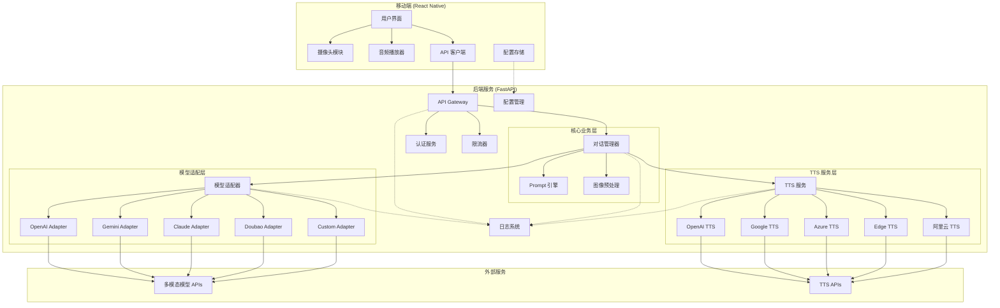
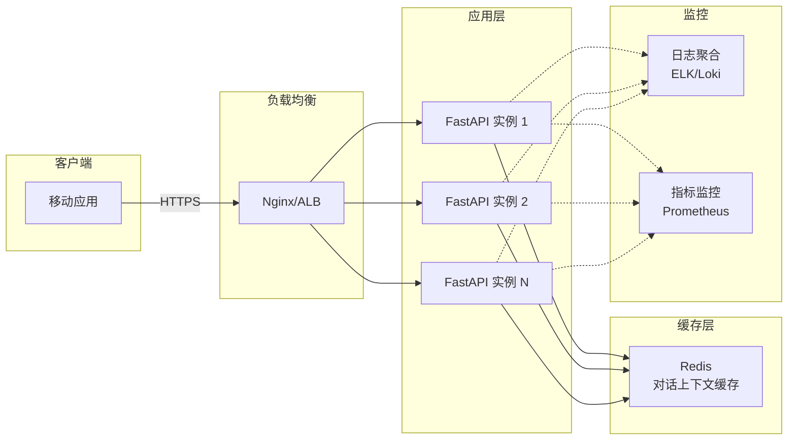

# Design Document: Pillow Talk 多模态助手

## Overview

Pillow Talk 是一款基于多模态大语言模型（MLLM）的智能视觉语音助手，采用移动端-后端分离架构。系统通过移动设备摄像头捕获现实世界图像，利用多模态 AI 模型进行视觉理解，并以自然语音形式输出对话内容。

### 核心目标

- 提供流畅的视觉-语音交互体验（TTFB < 5 秒）
- 支持多家云厂商模型及自定义模型接入
- 确保用户数据安全和隐私保护
- 实现高可用性和可扩展性（QPS >= 100）

### 技术栈

**移动端：**
- React Native + TypeScript
- React Native Camera / Expo Camera
- React Native Sound / Expo AV
- AsyncStorage（配置持久化）

**后端：**
- Python 3.11+
- FastAPI（异步 Web 框架）
- Poetry（依赖管理）
- Pydantic（数据验证）
- httpx（异步 HTTP 客户端）
- structlog（结构化日志）

### 架构原则

1. **关注点分离**：移动端专注 UI/UX，后端专注业务逻辑和模型集成
2. **可扩展性**：通过适配器模式支持新模型提供商
3. **安全优先**：所有通信使用 HTTPS，敏感数据加密存储
4. **性能优化**：异步 I/O、流式传输、智能缓存
5. **可观测性**：结构化日志、请求追踪、性能指标


## Architecture

### 系统架构图



### 数据流

#### 主流程：图像识别与语音对话

1. **图像采集**：用户通过移动端摄像头拍摄物体
2. **图像预处理**：压缩至 1MB 以下，转换为 Base64 编码
3. **请求发送**：移动端通过 HTTPS 发送图像和配置到后端
4. **认证与限流**：验证 API Key，检查请求频率
5. **对话管理**：创建或获取对话上下文
6. **Prompt 组装**：结合 System Prompt 和对话历史
7. **模型调用**：通过适配器调用选定的多模态模型
8. **流式响应**：通过 SSE 实时返回文本 token
9. **TTS 转换**：将文本转换为语音
10. **音频播放**：移动端接收音频并播放


### 后端项目结构（Src Layout）

```
pillow-talk-backend/
├── src/
│   └── pillow_talk/
│       ├── __init__.py
│       ├── main.py                    # FastAPI 应用入口
│       ├── config.py                  # 配置管理（pydantic-settings）
│       ├── api/
│       │   ├── __init__.py
│       │   ├── routes.py              # API 路由定义
│       │   ├── dependencies.py        # 依赖注入
│       │   └── middleware.py          # 中间件（日志、CORS）
│       ├── core/
│       │   ├── __init__.py
│       │   ├── conversation.py        # 对话管理器
│       │   ├── prompt.py              # Prompt 引擎
│       │   └── image.py               # 图像预处理
│       ├── adapters/
│       │   ├── __init__.py
│       │   ├── base.py                # MultimodalInterface 抽象基类
│       │   ├── openai.py              # OpenAI 适配器
│       │   ├── gemini.py              # Gemini 适配器
│       │   ├── claude.py              # Claude 适配器
│       │   ├── doubao.py              # 豆包适配器
│       │   └── custom.py              # 自定义模型适配器
│       ├── tts/
│       │   ├── __init__.py
│       │   ├── base.py                # TTS 接口
│       │   ├── openai_tts.py
│       │   ├── google_tts.py
│       │   ├── azure_tts.py
│       │   ├── edge_tts.py
│       │   └── ali_tts.py
│       ├── models/
│       │   ├── __init__.py
│       │   ├── request.py             # 请求模型（Pydantic）
│       │   ├── response.py            # 响应模型
│       │   └── config.py              # 配置模型
│       ├── services/
│       │   ├── __init__.py
│       │   ├── auth.py                # 认证服务
│       │   └── rate_limit.py          # 限流服务
│       └── utils/
│           ├── __init__.py
│           ├── logger.py              # 日志配置
│           ├── exceptions.py          # 自定义异常
│           └── parser.py              # 解析器和格式化器
├── tests/
│   ├── __init__.py
│   ├── conftest.py                    # pytest 配置
│   ├── unit/                          # 单元测试
│   └── property/                      # 属性测试
├── pyproject.toml                     # Poetry 配置
├── Dockerfile
├── docker-compose.yml
├── Makefile
├── .env.example
└── README.md
```

### 部署架构




## Components and Interfaces

### 1. API Gateway（API 网关）

**职责：**
- 接收和路由客户端请求
- 执行认证和限流
- 返回统一格式的响应

**接口：**

```python
# POST /api/v1/chat
class ChatRequest(BaseModel):
    image_base64: str
    system_prompt: str
    provider: str  # "openai" | "gemini" | "claude" | "doubao" | "custom"
    custom_config: Optional[CustomModelConfig] = None
    conversation_id: Optional[str] = None
    stream: bool = False

class ChatResponse(BaseModel):
    code: int
    message: str
    data: ChatData

class ChatData(BaseModel):
    text: str
    audio_url: Optional[str] = None
    conversation_id: str
    latency_ms: int

# POST /api/v1/test-connection
class TestConnectionRequest(BaseModel):
    provider: str
    custom_config: Optional[CustomModelConfig] = None

class TestConnectionResponse(BaseModel):
    code: int
    message: str
    data: TestConnectionData

class TestConnectionData(BaseModel):
    success: bool
    latency_ms: int
    error_message: Optional[str] = None

# GET /api/v1/models
class ModelsResponse(BaseModel):
    code: int
    message: str
    data: List[ModelInfo]

class ModelInfo(BaseModel):
    id: str
    name: str
    provider: str
    supports_vision: bool
    supports_streaming: bool
```

**依赖：**
- AuthenticationService（认证）
- RateLimiter（限流）
- ConversationManager（对话管理）


### 2. Model Adapter（模型适配层）

**职责：**
- 提供统一的多模态模型接口
- 处理不同厂商的 API 差异
- 支持流式和非流式响应

**抽象基类：**

```python
from abc import ABC, abstractmethod
from typing import AsyncIterator, Optional

class MultimodalInterface(ABC):
    """多模态模型统一接口"""
    
    @abstractmethod
    async def process_image(
        self,
        image_base64: str,
        prompt: str,
        conversation_history: Optional[List[Message]] = None,
        stream: bool = False
    ) -> AsyncIterator[str] | str:
        """
        处理图像和文本输入，返回模型响应
        
        Args:
            image_base64: Base64 编码的图像数据
            prompt: 文本提示词
            conversation_history: 对话历史
            stream: 是否使用流式输出
            
        Returns:
            流式输出时返回 AsyncIterator[str]，否则返回完整字符串
            
        Raises:
            ModelConnectionError: 模型连接失败
            ModelTimeoutError: 模型响应超时
            ModelAPIError: 模型 API 错误
        """
        pass
    
    @abstractmethod
    async def test_connection(self) -> bool:
        """测试模型连接是否正常"""
        pass
```

**具体实现：**

```python
class OpenAIAdapter(MultimodalInterface):
    """OpenAI GPT-4V/GPT-4o 适配器"""
    
    def __init__(self, api_key: str, model: str = "gpt-4o"):
        self.api_key = api_key
        self.model = model
        self.base_url = "https://api.openai.com/v1"
        self.client = httpx.AsyncClient(timeout=30.0)
    
    async def process_image(
        self,
        image_base64: str,
        prompt: str,
        conversation_history: Optional[List[Message]] = None,
        stream: bool = False
    ) -> AsyncIterator[str] | str:
        messages = self._build_messages(image_base64, prompt, conversation_history)
        
        if stream:
            return self._stream_response(messages)
        else:
            return await self._complete_response(messages)
    
    async def _stream_response(self, messages: List[dict]) -> AsyncIterator[str]:
        """流式响应处理"""
        async with self.client.stream(
            "POST",
            f"{self.base_url}/chat/completions",
            json={"model": self.model, "messages": messages, "stream": True},
            headers={"Authorization": f"Bearer {self.api_key}"}
        ) as response:
            async for line in response.aiter_lines():
                if line.startswith("data: "):
                    data = line[6:]
                    if data == "[DONE]":
                        break
                    chunk = json.loads(data)
                    if content := chunk["choices"][0]["delta"].get("content"):
                        yield content

class GeminiAdapter(MultimodalInterface):
    """Google Gemini 适配器"""
    # 实现细节...

class ClaudeAdapter(MultimodalInterface):
    """Anthropic Claude 适配器"""
    # 实现细节...

class DoubaoAdapter(MultimodalInterface):
    """字节豆包适配器"""
    # 实现细节...

class CustomAdapter(MultimodalInterface):
    """自定义模型适配器"""
    
    def __init__(self, base_url: str, api_key: str, model: str, headers: Optional[dict] = None):
        self.base_url = base_url
        self.api_key = api_key
        self.model = model
        self.custom_headers = headers or {}
        self.client = httpx.AsyncClient(timeout=30.0)
    
    # 实现细节...
```

**工厂模式：**

```python
class ModelAdapterFactory:
    """模型适配器工厂"""
    
    @staticmethod
    def create_adapter(
        provider: str,
        config: ModelConfig
    ) -> MultimodalInterface:
        adapters = {
            "openai": OpenAIAdapter,
            "gemini": GeminiAdapter,
            "claude": ClaudeAdapter,
            "doubao": DoubaoAdapter,
            "custom": CustomAdapter
        }
        
        adapter_class = adapters.get(provider)
        if not adapter_class:
            raise ValueError(f"Unsupported provider: {provider}")
        
        return adapter_class(**config.dict())
```


### 3. TTS Service（文本转语音服务）

**职责：**
- 将文本转换为语音
- 支持多家 TTS 提供商
- 支持流式和非流式输出

**接口：**

```python
from abc import ABC, abstractmethod

class TTSInterface(ABC):
    """TTS 服务统一接口"""
    
    @abstractmethod
    async def synthesize(
        self,
        text: str,
        voice: str = "default",
        speed: float = 1.0,
        language: str = "zh-CN"
    ) -> bytes:
        """
        合成语音
        
        Args:
            text: 要合成的文本
            voice: 语音类型（male/female）
            speed: 语速（0.5-2.0）
            language: 语言代码
            
        Returns:
            音频数据（MP3/AAC 格式）
            
        Raises:
            TTSServiceError: TTS 服务错误
        """
        pass

class OpenAITTSService(TTSInterface):
    """OpenAI TTS 服务"""
    
    def __init__(self, api_key: str):
        self.api_key = api_key
        self.base_url = "https://api.openai.com/v1"
        self.client = httpx.AsyncClient()
    
    async def synthesize(
        self,
        text: str,
        voice: str = "alloy",
        speed: float = 1.0,
        language: str = "zh-CN"
    ) -> bytes:
        response = await self.client.post(
            f"{self.base_url}/audio/speech",
            json={
                "model": "tts-1",
                "input": text,
                "voice": voice,
                "speed": speed
            },
            headers={"Authorization": f"Bearer {self.api_key}"}
        )
        return response.content

class TTSServiceFactory:
    """TTS 服务工厂"""
    
    @staticmethod
    def create_service(provider: str, config: TTSConfig) -> TTSInterface:
        services = {
            "openai": OpenAITTSService,
            "google": GoogleTTSService,
            "azure": AzureTTSService,
            "edge": EdgeTTSService,
            "ali": AliTTSService
        }
        
        service_class = services.get(provider)
        if not service_class:
            raise ValueError(f"Unsupported TTS provider: {provider}")
        
        return service_class(**config.dict())
```


### 4. Conversation Manager（对话管理器）

**职责：**
- 管理多轮对话上下文
- 生成和维护 conversation_id
- 清理过期对话

**接口：**

```python
from typing import List, Optional
from datetime import datetime, timedelta
import uuid

class Message(BaseModel):
    role: str  # "user" | "assistant"
    content: str
    timestamp: datetime

class Conversation(BaseModel):
    conversation_id: str
    messages: List[Message]
    created_at: datetime
    last_activity: datetime
    max_history: int = 10

class ConversationManager:
    """对话管理器"""
    
    def __init__(self, cache_ttl: int = 1800):  # 30 分钟
        self.conversations: dict[str, Conversation] = {}
        self.cache_ttl = cache_ttl
    
    def create_conversation(self) -> str:
        """创建新对话，返回 conversation_id"""
        conversation_id = str(uuid.uuid4())
        self.conversations[conversation_id] = Conversation(
            conversation_id=conversation_id,
            messages=[],
            created_at=datetime.now(),
            last_activity=datetime.now()
        )
        return conversation_id
    
    def add_message(self, conversation_id: str, role: str, content: str) -> None:
        """添加消息到对话历史"""
        if conversation_id not in self.conversations:
            raise ValueError(f"Conversation {conversation_id} not found")
        
        conversation = self.conversations[conversation_id]
        conversation.messages.append(
            Message(role=role, content=content, timestamp=datetime.now())
        )
        conversation.last_activity = datetime.now()
        
        # 保持最近 N 轮对话
        if len(conversation.messages) > conversation.max_history * 2:
            conversation.messages = conversation.messages[-conversation.max_history * 2:]
    
    def get_history(self, conversation_id: str) -> List[Message]:
        """获取对话历史"""
        if conversation_id not in self.conversations:
            return []
        return self.conversations[conversation_id].messages
    
    def cleanup_expired(self) -> None:
        """清理过期对话"""
        now = datetime.now()
        expired = [
            cid for cid, conv in self.conversations.items()
            if (now - conv.last_activity).total_seconds() > self.cache_ttl
        ]
        for cid in expired:
            del self.conversations[cid]
```


### 5. Prompt Engine（Prompt 引擎）

**职责：**
- 管理内置和自定义 Prompt 模板
- 组装完整的模型输入消息

**接口：**

```python
class PromptTemplate(BaseModel):
    id: str
    name: str
    system_prompt: str
    description: str

class PromptEngine:
    """Prompt 管理引擎"""
    
    BUILTIN_TEMPLATES = {
        "museum_guide": PromptTemplate(
            id="museum_guide",
            name="博物馆讲解员",
            system_prompt="你是一位专业的博物馆讲解员，擅长用生动有趣的方式介绍艺术品和历史文物...",
            description="专业、知识丰富、善于讲故事"
        ),
        "cute_pet": PromptTemplate(
            id="cute_pet",
            name="可爱宠物",
            system_prompt="你是一只可爱的小猫咪，用萌萌的语气和主人交流...",
            description="可爱、活泼、充满童趣"
        ),
        "science_expert": PromptTemplate(
            id="science_expert",
            name="科普专家",
            system_prompt="你是一位科普专家，善于用简单易懂的语言解释复杂的科学原理...",
            description="严谨、清晰、深入浅出"
        ),
        "sarcastic_critic": PromptTemplate(
            id="sarcastic_critic",
            name="毒舌评论家",
            system_prompt="你是一位毒舌评论家，用幽默讽刺的方式点评眼前的事物...",
            description="幽默、犀利、一针见血"
        ),
        "gentle_companion": PromptTemplate(
            id="gentle_companion",
            name="温柔陪伴者",
            system_prompt="你是一位温柔体贴的陪伴者，用温暖的话语关心和鼓励用户...",
            description="温柔、体贴、充满关怀"
        )
    }
    
    def get_template(self, template_id: str) -> Optional[PromptTemplate]:
        """获取 Prompt 模板"""
        return self.BUILTIN_TEMPLATES.get(template_id)
    
    def list_templates(self) -> List[PromptTemplate]:
        """列出所有内置模板"""
        return list(self.BUILTIN_TEMPLATES.values())
    
    def build_messages(
        self,
        system_prompt: str,
        image_base64: str,
        conversation_history: Optional[List[Message]] = None
    ) -> List[dict]:
        """组装模型输入消息"""
        messages = [{"role": "system", "content": system_prompt}]
        
        # 添加对话历史
        if conversation_history:
            for msg in conversation_history:
                messages.append({
                    "role": msg.role,
                    "content": msg.content
                })
        
        # 添加当前图像
        messages.append({
            "role": "user",
            "content": [
                {
                    "type": "image_url",
                    "image_url": {"url": f"data:image/jpeg;base64,{image_base64}"}
                }
            ]
        })
        
        return messages
```


### 6. Image Preprocessor（图像预处理器）

**职责：**
- 压缩图像至指定大小
- 转换图像格式
- Base64 编码

**接口：**

```python
from PIL import Image
import io
import base64

class ImagePreprocessor:
    """图像预处理器"""
    
    def __init__(self, max_size_mb: float = 1.0, quality: int = 85):
        self.max_size_bytes = int(max_size_mb * 1024 * 1024)
        self.quality = quality
    
    async def process(self, image_data: bytes) -> str:
        """
        处理图像并返回 Base64 编码
        
        Args:
            image_data: 原始图像数据
            
        Returns:
            Base64 编码的图像字符串
            
        Raises:
            ValueError: 图像格式无效
        """
        # 打开图像
        image = Image.open(io.BytesIO(image_data))
        
        # 转换为 RGB（处理 RGBA 等格式）
        if image.mode != "RGB":
            image = image.convert("RGB")
        
        # 压缩图像
        output = io.BytesIO()
        quality = self.quality
        
        while True:
            output.seek(0)
            output.truncate()
            image.save(output, format="JPEG", quality=quality, optimize=True)
            
            if output.tell() <= self.max_size_bytes or quality <= 50:
                break
            
            quality -= 5
        
        # Base64 编码
        output.seek(0)
        encoded = base64.b64encode(output.read()).decode("utf-8")
        
        return encoded
    
    def validate_image(self, image_data: bytes) -> bool:
        """验证图像是否有效"""
        try:
            Image.open(io.BytesIO(image_data))
            return True
        except Exception:
            return False
```


### 7. Authentication Service（认证服务）

**职责：**
- 验证 API Key
- 加密存储敏感信息

**接口：**

```python
from cryptography.fernet import Fernet
import hashlib

class AuthenticationService:
    """认证服务"""
    
    def __init__(self, encryption_key: str):
        # 使用 Fernet 对称加密（AES-256）
        key = hashlib.sha256(encryption_key.encode()).digest()
        self.cipher = Fernet(base64.urlsafe_b64encode(key))
    
    def encrypt_api_key(self, api_key: str) -> str:
        """加密 API Key"""
        return self.cipher.encrypt(api_key.encode()).decode()
    
    def decrypt_api_key(self, encrypted_key: str) -> str:
        """解密 API Key"""
        return self.cipher.decrypt(encrypted_key.encode()).decode()
    
    def validate_request(self, request_api_key: str) -> bool:
        """验证请求的 API Key"""
        # 实际实现中应该从数据库或配置中获取有效的 API Key 列表
        # 这里简化处理
        return len(request_api_key) > 0
```

### 8. Rate Limiter（限流器）

**职责：**
- 限制请求频率
- 防止滥用

**接口：**

```python
from collections import defaultdict
from datetime import datetime, timedelta
import asyncio

class RateLimiter:
    """限流器（基于滑动窗口）"""
    
    def __init__(self, max_requests_per_minute: int = 60):
        self.max_requests = max_requests_per_minute
        self.requests: defaultdict[str, list[datetime]] = defaultdict(list)
        self.lock = asyncio.Lock()
    
    async def check_rate_limit(self, identifier: str) -> tuple[bool, int]:
        """
        检查是否超过限流
        
        Args:
            identifier: 标识符（IP 地址或 API Key）
            
        Returns:
            (是否允许, 剩余配额)
        """
        async with self.lock:
            now = datetime.now()
            window_start = now - timedelta(minutes=1)
            
            # 清理过期记录
            self.requests[identifier] = [
                ts for ts in self.requests[identifier]
                if ts > window_start
            ]
            
            current_count = len(self.requests[identifier])
            
            if current_count >= self.max_requests:
                return False, 0
            
            self.requests[identifier].append(now)
            return True, self.max_requests - current_count - 1
    
    async def cleanup_expired(self) -> None:
        """清理过期记录"""
        async with self.lock:
            now = datetime.now()
            window_start = now - timedelta(minutes=1)
            
            for identifier in list(self.requests.keys()):
                self.requests[identifier] = [
                    ts for ts in self.requests[identifier]
                    if ts > window_start
                ]
                
                if not self.requests[identifier]:
                    del self.requests[identifier]
```


### 9. Logger（日志系统）

**职责：**
- 结构化日志记录
- 请求追踪

**接口：**

```python
import structlog
from typing import Any

def setup_logger(log_level: str = "INFO") -> structlog.BoundLogger:
    """配置结构化日志"""
    structlog.configure(
        processors=[
            structlog.contextvars.merge_contextvars,
            structlog.processors.add_log_level,
            structlog.processors.TimeStamper(fmt="iso"),
            structlog.processors.JSONRenderer()
        ],
        wrapper_class=structlog.make_filtering_bound_logger(
            getattr(structlog.stdlib, log_level)
        ),
        context_class=dict,
        logger_factory=structlog.PrintLoggerFactory(),
    )
    return structlog.get_logger()

class RequestLogger:
    """请求日志记录器"""
    
    def __init__(self, logger: structlog.BoundLogger):
        self.logger = logger
    
    def log_request(
        self,
        request_id: str,
        endpoint: str,
        method: str,
        **kwargs: Any
    ) -> None:
        """记录请求"""
        self.logger.info(
            "request_received",
            request_id=request_id,
            endpoint=endpoint,
            method=method,
            **kwargs
        )
    
    def log_response(
        self,
        request_id: str,
        status_code: int,
        latency_ms: int,
        **kwargs: Any
    ) -> None:
        """记录响应"""
        self.logger.info(
            "request_completed",
            request_id=request_id,
            status_code=status_code,
            latency_ms=latency_ms,
            **kwargs
        )
    
    def log_error(
        self,
        request_id: str,
        error_type: str,
        error_message: str,
        **kwargs: Any
    ) -> None:
        """记录错误"""
        self.logger.error(
            "request_error",
            request_id=request_id,
            error_type=error_type,
            error_message=error_message,
            **kwargs
        )
```

### 10. Parser and Pretty Printer（解析器和格式化器）

**职责：**
- 解析配置文件和 API 响应
- 格式化输出

**接口：**

```python
import json
import toml
from typing import Any, Dict

class Parser:
    """解析器"""
    
    @staticmethod
    def parse_toml(content: str) -> Dict[str, Any]:
        """解析 TOML 配置文件"""
        try:
            return toml.loads(content)
        except toml.TomlDecodeError as e:
            raise ValueError(f"Invalid TOML format: {e}")
    
    @staticmethod
    def parse_json(content: str) -> Dict[str, Any]:
        """解析 JSON 数据"""
        try:
            return json.loads(content)
        except json.JSONDecodeError as e:
            raise ValueError(f"Invalid JSON format: {e}")
    
    @staticmethod
    def parse_env(content: str) -> Dict[str, str]:
        """解析 .env 文件"""
        env_vars = {}
        for line in content.strip().split("\n"):
            line = line.strip()
            if line and not line.startswith("#"):
                if "=" in line:
                    key, value = line.split("=", 1)
                    env_vars[key.strip()] = value.strip()
        return env_vars

class PrettyPrinter:
    """格式化输出器"""
    
    @staticmethod
    def format_json(data: Any, indent: int = 2) -> str:
        """格式化 JSON"""
        return json.dumps(data, indent=indent, ensure_ascii=False)
    
    @staticmethod
    def format_toml(data: Dict[str, Any]) -> str:
        """格式化 TOML"""
        return toml.dumps(data)
    
    @staticmethod
    def format_error(error: Exception) -> Dict[str, Any]:
        """格式化错误信息"""
        return {
            "error_type": type(error).__name__,
            "error_message": str(error),
            "suggestion": _get_error_suggestion(error)
        }

def _get_error_suggestion(error: Exception) -> str:
    """根据错误类型返回建议"""
    suggestions = {
        "ModelConnectionError": "请检查网络连接和 API Key 是否正确",
        "ModelTimeoutError": "模型响应超时，请稍后重试",
        "TTSServiceError": "语音合成失败，请检查 TTS 服务配置",
        "RateLimitError": "请求过于频繁，请稍后再试"
    }
    return suggestions.get(type(error).__name__, "请联系技术支持")
```


## Data Models

### 请求模型

```python
from pydantic import BaseModel, Field, validator
from typing import Optional, Dict, Any
from enum import Enum

class ModelProvider(str, Enum):
    """模型提供商枚举"""
    OPENAI = "openai"
    GEMINI = "gemini"
    CLAUDE = "claude"
    DOUBAO = "doubao"
    CUSTOM = "custom"

class CustomModelConfig(BaseModel):
    """自定义模型配置"""
    base_url: str = Field(..., description="模型 API 基础 URL")
    api_key: str = Field(..., description="API 密钥")
    model_name: str = Field(..., description="模型名称")
    headers: Optional[Dict[str, str]] = Field(None, description="自定义 HTTP 头")
    
    @validator("base_url")
    def validate_url(cls, v):
        if not v.startswith(("http://", "https://")):
            raise ValueError("base_url must start with http:// or https://")
        return v

class ChatRequest(BaseModel):
    """对话请求"""
    image_base64: str = Field(..., description="Base64 编码的图像数据")
    system_prompt: str = Field(..., max_length=2000, description="系统提示词")
    provider: ModelProvider = Field(..., description="模型提供商")
    custom_config: Optional[CustomModelConfig] = Field(None, description="自定义模型配置")
    conversation_id: Optional[str] = Field(None, description="对话 ID")
    stream: bool = Field(False, description="是否使用流式输出")
    tts_enabled: bool = Field(True, description="是否启用 TTS")
    tts_voice: str = Field("default", description="语音类型")
    tts_speed: float = Field(1.0, ge=0.5, le=2.0, description="语速")
    
    @validator("image_base64")
    def validate_image(cls, v):
        if not v:
            raise ValueError("image_base64 cannot be empty")
        # 验证 Base64 格式
        try:
            base64.b64decode(v)
        except Exception:
            raise ValueError("Invalid Base64 encoding")
        return v

class TestConnectionRequest(BaseModel):
    """测试连接请求"""
    provider: ModelProvider
    custom_config: Optional[CustomModelConfig] = None
```

### 响应模型

```python
from typing import Optional, List
from datetime import datetime

class ChatData(BaseModel):
    """对话数据"""
    text: str = Field(..., description="AI 生成的文本")
    audio_url: Optional[str] = Field(None, description="音频文件 URL")
    conversation_id: str = Field(..., description="对话 ID")
    latency_ms: int = Field(..., description="处理延迟（毫秒）")
    token_usage: Optional[Dict[str, int]] = Field(None, description="Token 使用量")

class ChatResponse(BaseModel):
    """对话响应"""
    code: int = Field(..., description="状态码")
    message: str = Field(..., description="响应消息")
    data: Optional[ChatData] = Field(None, description="响应数据")
    request_id: str = Field(..., description="请求 ID")

class TestConnectionData(BaseModel):
    """测试连接数据"""
    success: bool
    latency_ms: int
    error_message: Optional[str] = None

class TestConnectionResponse(BaseModel):
    """测试连接响应"""
    code: int
    message: str
    data: TestConnectionData
    request_id: str

class ModelInfo(BaseModel):
    """模型信息"""
    id: str
    name: str
    provider: str
    supports_vision: bool
    supports_streaming: bool
    description: str

class ModelsResponse(BaseModel):
    """模型列表响应"""
    code: int
    message: str
    data: List[ModelInfo]

class ErrorResponse(BaseModel):
    """错误响应"""
    code: int
    message: str
    error_type: str
    suggestion: str
    request_id: str
```

### 配置模型

```python
from pydantic_settings import BaseSettings

class Settings(BaseSettings):
    """应用配置"""
    # 应用配置
    app_name: str = "Pillow Talk Backend"
    app_version: str = "1.0.0"
    debug: bool = False
    
    # 服务器配置
    host: str = "0.0.0.0"
    port: int = 8000
    workers: int = 4
    
    # 安全配置
    encryption_key: str = Field(..., description="加密密钥")
    allowed_origins: List[str] = ["*"]
    
    # 限流配置
    rate_limit_per_minute: int = 60
    rate_limit_per_api_key: int = 100
    
    # 对话配置
    conversation_ttl: int = 1800  # 30 分钟
    max_conversation_history: int = 10
    
    # 图像处理配置
    max_image_size_mb: float = 1.0
    image_quality: int = 85
    
    # 模型配置
    model_timeout: int = 30
    model_max_retries: int = 3
    
    # TTS 配置
    tts_timeout: int = 10
    
    # 日志配置
    log_level: str = "INFO"
    log_format: str = "json"
    
    class Config:
        env_file = ".env"
        env_file_encoding = "utf-8"
```

### 内部数据模型

```python
class Message(BaseModel):
    """对话消息"""
    role: str  # "user" | "assistant" | "system"
    content: str
    timestamp: datetime = Field(default_factory=datetime.now)

class Conversation(BaseModel):
    """对话会话"""
    conversation_id: str
    messages: List[Message] = []
    created_at: datetime = Field(default_factory=datetime.now)
    last_activity: datetime = Field(default_factory=datetime.now)
    max_history: int = 10

class RequestMetrics(BaseModel):
    """请求指标"""
    request_id: str
    endpoint: str
    method: str
    status_code: int
    latency_ms: int
    image_processing_ms: int
    model_call_ms: int
    tts_generation_ms: int
    timestamp: datetime = Field(default_factory=datetime.now)
```

