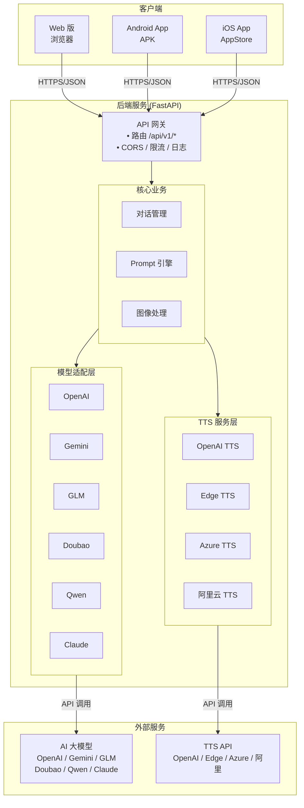

# Pillow Talk - 多模态智能视觉语音助手

<div align="center">

**一款基于多模态大语言模型的智能视觉语音助手**

通过摄像头扫描现实物体，AI 进行视觉理解并生成自然的语音对话


[功能特性](#功能特性) • [快速开始](#快速开始) • [架构设计](#架构设计) • [开发指南](#开发指南) • [部署](#部署)

</div>

---

## 🚀 如何使用

**快速开始：**

1. **启动后端服务**
   ```bash
   cd pillow-talk-backend
   cp .env.example .env  # 编辑 .env 填入 API Keys
   docker-compose up -d
   ```

2. **启动移动版（浏览器访问）**
   ```bash
   cd pillow-talk-mobile
   python -m http.server 8080
   ```
   然后访问 http://localhost:8080

3. **打包 Android APK**
   - **Windows**: 双击 `build-apk.bat`
   - **Linux/Mac/WSL**: 运行 `./build-apk.sh`

4. **构建 iOS App** (macOS only)
   ```bash
   ./build-ios.sh              # 构建模拟器版本
   ./build-ios.sh device       # 构建真机版本
   ./build-ios.sh open         # 打开 Xcode 项目
   ```
---

## 使用方式

1. **开发模式** - 快速测试，无需打包
   ```bash
   # 启动后端
   cd pillow-talk-backend && docker-compose up -d
   
   # 启动移动版（浏览器访问）
   cd pillow-talk-mobile && python -m http.server 8080
   ```

2. **打包 APK** - 分发给其他用户
   - **Windows**: 双击运行 `build-apk.bat`
   - **Linux/Mac/WSL**: 运行 `./build-apk.sh`
   - 支持 Debug/Release 模式，可自动安装到设备

3. **构建 iOS App** - 仅限 macOS
   - 运行 `./build-ios.sh`
   - 支持模拟器/真机构建，可自动打开 Xcode

---

## 项目概述

Pillow Talk 是一款创新的多模态 AI 助手应用，结合了计算机视觉、自然语言处理和语音合成技术。用户只需用手机摄像头扫描物体，AI 就能识别并用自然语音与你对话，提供陪伴、科普或娱乐体验。

### 核心能力

- 🎯 **视觉识别**：实时预览或拍照扫描物体，利用多模态模型进行视觉理解
- 🤖 **多模型支持**：支持 OpenAI、Google Gemini、智谱 GLM、豆包、千问等主流模型
- 💬 **多轮对话**：保持上下文的连续对话，让交互更自然
- 🎭 **人设切换**：内置多种 Prompt 模板（博物馆讲解员、可爱宠物、科普专家等）
- 🔊 **语音交互**：将 AI 生成的文本转化为自然语音输出（TTS）
- 📱 **跨平台**：支持 iOS 15.0+ 和 Android 10.0+ 设备

---

## 功能特性

### 移动端功能

#### 📷 摄像头模块
- 实时预览与自动对焦
- 支持手动拍照或自动识别模式
- 图像预处理：压缩、裁剪后转换为 Base64 上传
- 完善的权限管理

#### 🎨 模型配置
- **预设模型**：OpenAI GPT-4o/4V、Google Gemini 2.5 Pro、智谱 GLM-4V、豆包、千问
- **自定义模型**：支持配置自定义 API 端点
- **测试连接**：验证模型配置有效性

#### 💭 Prompt 管理
- 内置多种人设模板
- 支持自定义 System Prompt
- 快速切换对话风格

#### 🎵 语音播放
- 支持多种 TTS 服务（OpenAI、Google、Azure、Edge、阿里云）
- 男声/女声选择
- 语速调整（0.5x - 2.0x）
- 流式播放和语音缓存

#### 📝 历史记录
- 本地保存最近的扫描和对话记录
- 支持查看、删除和清空历史

### 后端功能

#### 🔌 模型适配层
- 统一的多模态接口抽象
- 支持多家云厂商模型
- 流式响应支持（SSE）
- 智能错误处理和重试

#### 🎯 Prompt 引擎
- 灵活的 Prompt 模板系统
- 多轮对话上下文管理
- 自动组装符合各模型要求的消息结构

#### 🔊 TTS 服务
- 支持多种 TTS 提供商
- 流式音频输出
- 音频格式转换

#### 🔒 安全特性
- API Key 加密存储（AES-256）
- 请求限流保护
- HTTPS 通信
- 输入验证和注入防护

#### 📊 可观测性
- 结构化日志记录
- 请求追踪（request_id）
- 性能指标监控

---

## 快速开始

### 环境要求

#### 后端
- Python 3.11+
- Poetry 或 uv

#### 移动端
- Node.js 18+
- npm 或 yarn
- Expo CLI
- iOS Simulator（iOS 开发）或 Xcode
- Android Studio 和 Android SDK（Android 开发）

### 安装和运行

#### 1. 后端服务

```bash
# 进入后端目录
cd pillow-talk-backend

# 安装依赖
poetry install

# 如果需要特定模型支持
poetry install -E ark      # 豆包支持
poetry install -E glm      # 智谱 GLM 支持
poetry install -E gemini   # Gemini 支持

# 配置环境变量
cp .env.example .env
# 编辑 .env 文件，设置必需的 API Keys

# 运行服务
make run
# 或
uvicorn pillow_talk.main:app --reload
```

服务将在 http://localhost:8000 启动

API 文档：
- Swagger UI: http://localhost:8000/docs
- ReDoc: http://localhost:8000/redoc

#### 2. 移动版（浏览器访问）

```bash
# 进入移动端目录
cd pillow-talk-mobile

# 启动简单的 HTTP 服务器
python -m http.server 8080

# 或使用 start.sh 脚本（如果可用）
./start.sh
```

然后在浏览器访问 http://localhost:8080

#### 3. 打包 Android APK

```bash
# Windows
build-apk.bat

# Linux/Mac/WSL
./build-apk.sh
```

---

## 架构设计

### 系统架构



### 技术栈

| 层级 | 技术 | 说明 |
|------|------|------|
| **后端** | FastAPI + Python 3.11+ | 高性能异步 Web 框架 |
| | Poetry | 依赖管理 |
| | Pydantic | 数据验证与序列化 |
| | structlog | 结构化日志 |
| **移动端** | Capacitor | 跨平台混合应用框架 |
| | WebView | 原生 Web 容器 |
| **前端** | HTML5 + JavaScript | Web 页面 |
| | Canvas | 图像预览与处理 |

---

## 项目结构

### 后端结构

```
pillow-talk-backend/
├── src/
│   └── pillow_talk/
│       ├── main.py              # FastAPI 应用入口
│       ├── config.py            # 配置管理
│       ├── api/                 # API 路由和中间件
│       │   ├── routes.py
│       │   ├── middleware.py
│       │   └── dependencies.py
│       ├── core/                # 核心业务逻辑
│       │   ├── conversation.py  # 对话管理
│       │   ├── prompt.py        # Prompt 引擎
│       │   └── image.py         # 图像预处理
│       ├── adapters/            # 模型适配器
│       │   ├── base.py
│       │   ├── openai.py
│       │   ├── gemini.py
│       │   ├── glm.py
│       │   ├── doubao.py
│       │   ├── qwen.py
│       │   └── claude.py
│       ├── tts/                 # TTS 服务
│       │   ├── adapters/        # TTS 适配器
│       │   ├── system.py
│       │   ├── config.py
│       │   └── storage.py
│       ├── models/              # 数据模型
│       │   ├── request.py
│       │   ├── response.py
│       │   └── config.py
│       └── utils/               # 工具函数
│           ├── logger.py
│           ├── exceptions.py
│           └── parser.py
├── tests/                       # 测试目录结构
├── pyproject.toml              # Poetry 配置
├── Dockerfile
├── docker-compose.yml
└── README.md
```

### 移动端结构

```
pillow-talk-mobile/
├── android/                    # Capacitor Android 项目
├── www/                        # Web 构建输出
├── index.html                  # 主页面
├── package.json
└── capacitor.config.json       # Capacitor 配置
```

---

## API 文档

### 核心端点

#### 1. 对话接口

```http
POST /api/v1/chat
Content-Type: application/json

{
  "image_base64": "data:image/jpeg;base64,...",
  "system_prompt": "你是一个博学的博物馆讲解员",
  "provider": "openai",
  "stream": false,
  "tts_enabled": true,
  "conversation_id": "uuid"  // 可选，用于多轮对话
}
```

**响应**：
```json
{
  "code": 0,
  "message": "success",
  "data": {
    "text": "这是一个精美的青花瓷瓶...",
    "audio_url": "https://storage.../audio.mp3",
    "conversation_id": "uuid",
    "latency_ms": 1200
  }
}
```

#### 2. 测试连接

```http
POST /api/v1/test-connection
Content-Type: application/json

{
  "provider": "custom",
  "custom_config": {
    "base_url": "http://my-server/v1",
    "api_key": "sk-...",
    "model_name": "llava-v1.5"
  }
}
```

#### 3. 获取模型列表

```http
GET /api/v1/models
```

#### 4. 健康检查

```http
GET /health
```

### 支持的模型提供商

- `openai`: OpenAI GPT-4V/4o
- `gemini`: Google Gemini 多模态模型
- `glm`: 智谱 AI GLM-4V 系列
- `doubao`: 字节跳动豆包视觉模型
- `qwen`: 阿里云千问视觉模型
- `custom`: 自定义模型端点

---

## 开发指南

### 后端开发

#### 代码规范

```bash
# 格式化代码
make format

# 代码检查
make lint

# 类型检查
make type-check

# 运行测试
make test

# 测试覆盖率
make coverage
```

#### 添加新的模型适配器

1. 在 `src/pillow_talk/adapters/` 创建新文件
2. 继承 `MultimodalInterface` 基类
3. 实现 `process_image` 和 `test_connection` 方法
4. 在 `ModelAdapterFactory` 中注册新适配器

示例：
```python
from .base import MultimodalInterface

class NewModelAdapter(MultimodalInterface):
    async def process_image(
        self,
        image_data: str,
        prompt: str,
        conversation_history: list[dict[str, str]] | None = None,
        stream: bool = False,
    ) -> str | AsyncIterator[str]:
        # 实现逻辑
        pass
    
    async def test_connection(self) -> tuple[bool, str, float]:
        # 实现逻辑
        pass
```

### 移动端开发

#### 代码规范

```bash
# ESLint 检查
yarn lint

# 修复 ESLint 问题
yarn lint:fix

# 格式化代码
yarn format

# 类型检查
yarn type-check

# 运行测试
yarn test
```

#### 添加新屏幕

1. 在 `src/screens/` 创建新组件
2. 在 `src/navigation/AppNavigator.tsx` 中注册路由
3. 添加必要的类型定义

---

## 部署

### Docker 部署（后端）

#### 构建镜像

```bash
cd pillow-talk-backend
make docker-build
```

#### 运行容器

```bash
make docker-run
```

#### 使用 Docker Compose

```bash
docker-compose up -d
```

### 移动端打包

#### Android（推荐）

使用一键构建脚本：

```bash
# Windows - 双击运行或命令行
build-apk.bat              # 构建 Debug APK
build-apk.bat release      # 构建 Release APK
build-apk.bat debug install  # 构建并自动安装到设备

# Linux/Mac/WSL
./build-apk.sh              # 构建 Debug APK（默认）
./build-apk.sh release      # 构建 Release APK
./build-apk.sh debug install # 构建并自动安装到设备
```

手动构建（高级用户）：

```bash
cd pillow-talk-mobile

# 安装依赖
npm install

# 同步资源到 Android
npx cap sync

# 构建 APK
cd android
./gradlew assembleDebug    # Debug 版本
./gradlew assembleRelease  # Release 版本
```

#### iOS

使用一键构建脚本（macOS only）：

```bash
./build-ios.sh                    # 构建模拟器版本（默认）
./build-ios.sh simulator open     # 构建并打开 Xcode
./build-ios.sh device             # 构建真机版本
./build-ios.sh open               # 仅打开 Xcode 项目
```

手动构建（高级用户）：

```bash
cd pillow-talk-mobile

# 安装 iOS 平台依赖
npm install @capacitor/ios

# 添加 iOS 平台（首次）
npx cap add ios

# 同步资源
npx cap sync ios

# 打开 Xcode 项目
npx cap open ios

# 然后在 Xcode 中配置签名并构建
```

---

## 配置说明

### 后端环境变量

创建 `.env` 文件：

```env
# 应用配置
APP_NAME=pillow-talk
APP_VERSION=0.1.0
DEBUG=false

# 服务器配置
HOST=0.0.0.0
PORT=8000

# 安全配置
ENCRYPTION_KEY=your-encryption-key-here  # 必须修改！

# 模型 API Keys（根据使用的模型配置）
OPENAI_API_KEY=sk-...
DOUBAO_API_KEY=...
GLM_API_KEY=...
GEMINI_API_KEY=...
QWEN_API_KEY=...

# TTS 配置
TTS_PROVIDER=openai
TTS_VOICE=alloy
TTS_SPEED=1.0

# 日志配置
LOG_LEVEL=INFO
```

### 移动端环境变量

创建 `.env` 文件：

```env
# API 配置
API_BASE_URL=http://localhost:8000

# 默认配置
DEFAULT_MODEL=openai
DEFAULT_TTS_PROVIDER=openai
```

---

## 性能指标

- **图像处理时间**：< 500ms
- **首字延迟（TTFB）**：< 3 秒（网络良好）
- **TTS 首字延迟**：< 3 秒
- **并发支持**：> 100 QPS
- **音频暂停响应**：< 100ms
- **界面响应时间**：< 200ms

---

## 安全特性

- ✅ 所有 API 通信使用 HTTPS
- ✅ API Key 使用 AES-256 加密存储
- ✅ 请求限流保护（60 req/min per IP）
- ✅ 输入验证和注入防护
- ✅ 图像数据不持久化存储
- ✅ 结构化日志不包含敏感信息

---

## 故障排除

### 后端常见问题

**问题：模型连接失败**
- 检查 API Key 是否正确配置
- 检查网络连接
- 查看日志获取详细错误信息

**问题：TTS 服务不可用**
- 确认 TTS 提供商的 API Key 已配置
- 检查 TTS 配置文件格式

### 移动端常见问题

**问题：摄像头无法打开**
- 检查设备权限设置
- 确认 Info.plist（iOS）或 AndroidManifest.xml（Android）中已添加权限

**问题：无法连接后端**
- 检查 API_BASE_URL 配置
- 确认后端服务正在运行
- 检查网络连接

---

## 路线图

### Phase 1: MVP ✅
- [x] 后端基础架构
- [x] OpenAI GPT-4V 接入
- [x] 移动端基础相机页面
- [x] 拍照识别流程

### Phase 2: 多模型和语音 🚧
- [x] 多模型适配层
- [x] TTS 服务集成
- [ ] 自定义 API 配置
- [ ] Prompt 配置界面

### Phase 3: 优化和发布 📋
- [ ] 性能优化
- [ ] 多轮对话支持
- [ ] 完整测试覆盖
- [ ] 应用商店上架

### Phase 4: 扩展功能 💡
- [ ] AR 模式识别
- [ ] 情绪陪伴模式
- [ ] 社区分享
- [ ] 云端对话记录同步
- [ ] 本地轻量模型推理

---

## 贡献指南

我们欢迎所有形式的贡献！

1. Fork 本仓库
2. 创建特性分支 (`git checkout -b feature/AmazingFeature`)
3. 提交更改 (`git commit -m 'Add some AmazingFeature'`)
4. 推送到分支 (`git push origin feature/AmazingFeature`)
5. 开启 Pull Request

### 开发规范

- 遵循项目的代码风格
- 添加必要的测试
- 更新相关文档
- 确保所有测试通过

---

## 许可证

本项目采用 MIT 许可证 - 详见 [LICENSE](LICENSE) 文件

---

## 联系方式

- 项目主页：https://github.com/pillow-talk
- 问题反馈：https://github.com/pillow-talk/issues
- 邮箱：team@pillowtalk.ai

---

## 致谢

感谢以下开源项目和服务：

- [FastAPI](https://fastapi.tiangolo.com/) - 现代化的 Python Web 框架
- [React Native](https://reactnative.dev/) - 跨平台移动应用框架
- [OpenAI](https://openai.com/) - 多模态 AI 模型
- [Google Gemini](https://deepmind.google/technologies/gemini/) - 多模态 AI 模型
- [智谱 AI](https://www.zhipuai.cn/) - GLM 系列模型
- [字节跳动](https://www.volcengine.com/) - 豆包模型
- [阿里云](https://www.aliyun.com/) - 千问模型

---

<div align="center">

**用 AI 的眼睛看世界，用温暖的声音陪伴你** ❤️

Made with ❤️ by Pillow Talk Team

</div>


---

## 📝 文档

- `README.md` - 项目概览（本文档）
- `pillow_talk_需求文档.md` - 产品需求文档
- `安装环境.md` - 环境安装指南
- `pillow-talk-backend/README.md` - 后端文档

---

## 🤝 贡献

欢迎贡献代码、报告问题或提出建议！

---

## 📄 许可证

MIT License

---

## 🙏 致谢

感谢所有开源项目和 AI 服务提供商的支持。

---

**最后更新**: 2026-03-11
